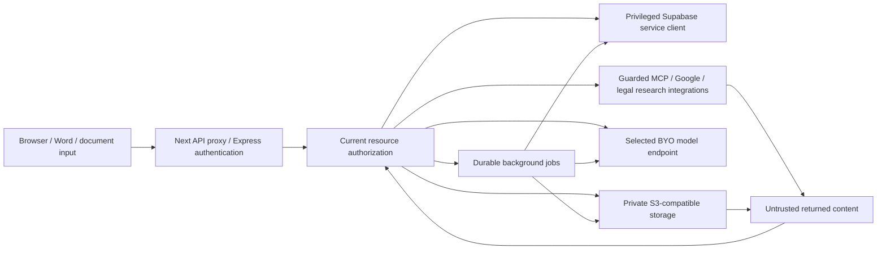

# Threat model — 8 October 2026

## Assets and attackers

Assets: confidential legal documents/versions, project/org membership,
conversation and memory content, provider and connector credentials, OAuth
state/handoff tickets, signed storage capabilities, approvals, database service
credentials, audit history and release/build integrity.

Attackers considered: unauthenticated HTTP clients; a valid user guessing
foreign resource IDs; a previously authorized user after revocation; malicious
uploaded/retrieved documents; a connected malicious MCP peer; hostile model
output/tool arguments; compromised dependencies/actions and a maintainer account;
misconfigured operator infrastructure. No live adversary exercise was performed.

## Flows and trust boundaries

The diagram describes implemented paths, not evidence all integrations are
configured. Input text/model output is not authority. Provider credentials and
server-role database access remain server-side. A local deployment can still
send content to remote configured providers.

## Primary threats and controls

| Threat | Inspected control | Limits / remaining evidence |
| --- | --- | --- |
| Missing/invalid session | requireAuth uses provider getUser; trusted-origin checks for cookie mutations; HttpOnly/Secure production cookie policy | Live JWT issuer/audience/algorithm and provider revocation enforcement not exercised |
| IDOR/tenant bleed | access/projectAccess/resource helpers; document-specific checks; current-context reauthorization before tools/provider/persistence | All endpoint combinations and live RLS behavior not exhaustively proven |
| Revoked sharing during work | streaming/tool/memory/worker rechecks | Already emitted output or committed external effects cannot be recalled |
| Prompt injection | capability catalog, tool dispatch authorization, validation, request-bound context; citations hydrate separately authorized documents | Fencing cannot guarantee model behavior; MCP annotations remain peer-controlled |
| Unauthorized Google writes | encrypted expiring proposal, human-only action approval route, atomic owner/grant checked SQL consume | Live provider/SQL concurrency not tested here |
| SSRF/token forwarding | outbound HTTP and MCP URL/DNS/connect checks, manual redirect validation and cross-origin credential stripping | Host firewall/DNS/egress configuration not verified; SEC-001 now bounds GET bodies |
| Office decompression DoS | SEC-003 actual-byte aggregate/entry admission before affected parsers | Synchronous XML and other document parser families need further isolation review |
| XSS/unsafe previews | DOMPurify case HTML, DOCX URL scheme allowlist, no raw Markdown HTML, shared CSP | Real browser/Office rendering not run; no universal sanitizer assertion |
| Stored capability theft | current auth before download; generated keys; signed URLs capped 900 seconds | Issued finite bearer URLs can outlive revocation; bucket/provider enforcement unverified |
| Log disclosure | Sentry privacy boundary plus SEC-002 safe central console summaries | Other log paths and external retention not certified |
| Cost/availability abuse | bounded request bodies, per-user/IP limits, queue admission, conversion/stream deadlines | Quotas disabled by default; no global provider-spend cap; Redis fallback is process-local |
| Build/release compromise | lockfile CI installs, audit gate, CodeQL/gitleaks workflows | High dev advisories, mutable action tags and no effective main protection remain open |

## Database and storage assumptions

`backend/src/lib/supabase.ts` explicitly uses a service-role client that bypasses
RLS. Application authorization is essential, not optional defense delegated to
RLS. `backend/schema.sql` enables RLS/revokes browser roles on backend data,
restricts sensitive RPC execution and hardens function search_path/default
privileges. These statements describe inspected source, not the installed
production schema. The client uses Supabase directly for authentication.

`storage.ts` uses configured S3-compatible endpoints and a private-bucket
assumption, generated keys, bounded capability lifetime and safe content
disposition. The object-store operator must prove public access is disabled,
headers/signatures/expiry enforce correctly, and backup/restore/deletion match
policy. No existing deployment, data, migration or setting was modified.

## Review boundary

High-risk families and existing regression contracts were inspected with local
synthetic/mock tests. This review is not line-by-line proof of all 266 route
variants, a formal cryptographic review, a live cloud audit, an exhaustive
malicious-document corpus, or end-to-end model red-team certification. See the
findings ledger and executed test record for positive evidence and gaps.
